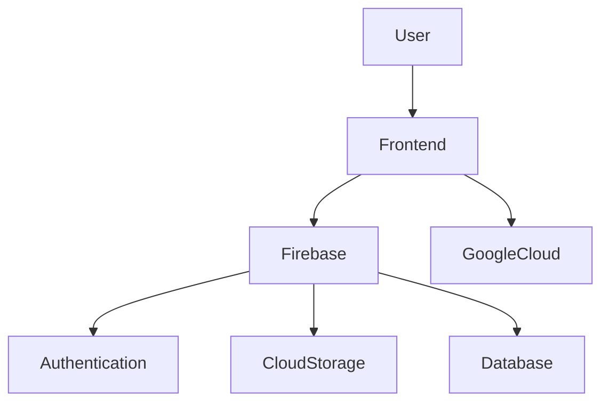

# **Lenshub Project**

---

## **Project Description**

**Lenshub** is a comprehensive photography platform designed to empower photographers to showcase their portfolios, connect with a vibrant community, and explore creative works. By leveraging cutting-edge technologies like Flutter and Firebase, Lenshub ensures a seamless and immersive user experience across devices.

---

## **Key Features**

- **Responsive Photo Galleries**: Upload and showcase high-quality images.
- **Social Interactions**: Like, share, and comment on photos.
- **Cross-Platform Compatibility**: Available on mobile and web.
- **Cloud Integration**: Secure and scalable storage with Firebase.
- **User Authentication**: Easy and secure sign-in using Firebase Authentication.

---

## **Architecture Overview**

### **System Flow:**
1. **Frontend**: Built with Flutter (Dart), providing a dynamic and intuitive UI.
2. **Backend**: Firebase handles real-time database operations, cloud storage, and user authentication.
3. **Hosting**: Google Cloud ensures robust performance and scalability.

### **Architecture Diagram**


---

## **Technologies Used**

| **Technology**       | **Purpose**                  |
|-----------------------|------------------------------|
| **Flutter**           | Frontend development         |
| **Dart**              | Programming language         |
| **Firebase**          | Authentication and backend   |
| **Google Cloud**      | Hosting and scalability      |
| **Git**               | Version control              |
| **Adobe XD**          | UI/UX design prototyping     |

---

## **Setup Instructions**

### **Prerequisites**
- Install [Flutter](https://flutter.dev/docs/get-started/install).
- Set up Firebase project and download the `google-services.json` file.

### **Steps to Run the Project**
1. Clone the repository:
   ```bash
   git clone https://github.com/username/lenshub.git
   ```
2. Navigate to the project directory:
   ```bash
   cd lenshub
   ```
3. Install dependencies:
   ```bash
   flutter pub get
   ```
4. Run the project:
   ```bash
   flutter run
   ```

---

## **Development Progress**

### **Successes**
- Achieved seamless integration of Firebase for real-time database operations.
- Developed a visually appealing UI/UX using Flutter's flexible widgets.
- Ensured compatibility across devices and platforms.

### **Challenges**
- Overcame network and power interruptions during development.
- Resolved UI scaling issues on smaller devices.

---

## **Future Plans**

- **AI-Driven Features**: Add image tagging and search functionalities.
- **Premium Subscriptions**: Introduce advanced editing tools.
- **Desktop Applications**: Extend functionality to desktop users.

---

## **Lessons Learned**

- Importance of planning for unexpected challenges (e.g., power outages).
- Leveraging community feedback for iterative improvements.
- Gained proficiency in cloud-based development.

---

## **Contributors**

- **Ulf Munga** - [GitHub](https://github.com/username) | [LinkedIn](https://linkedin.com/in/username)

---

## **License**

This project is licensed under the MIT License - see the [LICENSE](LICENSE) file for details.

---

## **Contact**

For any inquiries, feel free to reach out:
- **Email**: ulfmunger@example.com
- **GitHub Repository**: [Lenshub]([https://github.com/username/lenshub](https://github.com/sunjoe508/LENSHUB_Webstack---Portfolio-Project-.git))  

---

### **Project Gallery**
  

Explore the possibilities with Lenshub and bring your photography to life!
